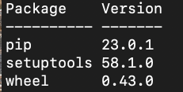

this is the answer of the question

understanding docker first run

Run docker with the python:3.9 image in an interactive mode and the entrypoint of bash. Now check the python modules that are installed ( use pip list ).

What is version of the package wheel ?

0.42.0
1.0.0
23.0.1
58.1.0

